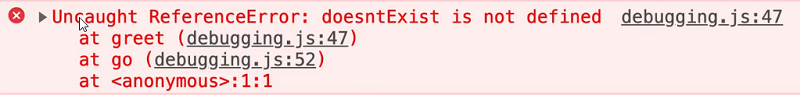

# Debugowanie - Developer Tools Chrome

[Chrome DevTools Keyboard Shortcuts](https://developers.google.com/web/tools/chrome-devtools/shortcuts)

| Komenda                                                   | Działanie                                                                     |
| --------------------------------------------------------- | ----------------------------------------------------------------------------- |
| `F12`                                                     | Otwórz narzędzia deweloperskie (ostatni używany panel)                        |
| `CTRL + SHIFT + I`                                        | Otwórz narzędzia deweloperskie (ostatni używany panel)                        |
| `CTRL + SHIFT + P`                                        | Otwórz listę komend (przy otwartych narzędziach)                              |
| `CTRL + SHIFT + J`                                        | Otwórz narzędzia deweloperskie (Console)                                      |
| `CTRL + SHIFT + C`                                        | Otwórz narzędzia deweloperskie (Elements)                                     |
| `CTRL + SHIFT + D`                                        | Zmień pozycję narzędzi dół/bok                                                |
| `CTRL + SHIFT + C`                                        | Narzędzie selekcji                                                            |
| `CTRL + [`                                                | Następny panel                                                                |
| `CTRL + ]`                                                | Poprzedni panel                                                               |
| `P-KLIK na ikonę odświeżenia → Opróżnij pamięć podręczną` | Przy włączonych narzędziach deweloperskich czyści cache i przeładowuje stronę |
| `Preserve log`                                            | Konsola nie czyści się przy przeładowaniu (Panel opcji ikona zębatki)         |

## Console

| Komenda                              | Działanie                                                                       |
| ------------------------------------ | ------------------------------------------------------------------------------- |
| `console.clear()`                    | Wyczyść konsolę                                                                 |
| `console.log()`                      | Wyświetla podany komunikat                                                      |
| `console.dir(element)`               | Wyświetla obiektową reprezentację wskazanego elementu                           |
| `console.table(element)`             | Wyświetla element w konsoli w postaci tabeli                                    |
| `console.count()`                    | Wyświetla ilość wywołań kodu, przyjmuje string z komunikatem jako parametr      |
| `console.group('Nazwa grupy')`       | Tworzy grupę komend                                                             |
| `console.assert(warunek, false-msg)` | Sprawdza czy `warunek` jest spełniony, jeśli nie drukuje `false-msg`            |
| `console.time()`                     | Wykonuje test szybkości skryptu                                                 |
| `$(selektor)`                        | Znajduje element o podanym selektorze (odpowiednik `querySelector`)             |
| `$$`                                 | Znajduje wszystkie elementy o podanym selektorze (dpowiednik `querSelectorAll`) |
| `$_`                                 | Zwraca wynik ostatniej operacji                                                 |
| `$0`                                 | Wyświetla ostatnio kliknięty element (kolejne numery to kolejne elementy)       |
| `-DevTools`                          | Wpisane w filtrze górnego paska konsoli usuwa błędy narzędzi                    |

```javascript
// Grupowanie wielu komend
console.group("Nazwa grupy");
console.log("Ala ma kota");
console.log("Kot ma Alę");
console.groupEnd(); // Koniec grupy

// Grupa domyślnie zwinięta
console.groupCollapsed("Nazwa grupy");
console.log("Ala ma kota");
console.log("Kot ma Alę");
console.groupEnd(); // Koniec grupy

// Test szybkości skryptu
console.time('test 1'); //rozpoczyna test - zaczyna liczyć czas
for (let i=0; i<10000; i++) {
    ...
}
console.timeEnd('test 1'); //kończy test
```

### Callstack (Stack Trace)

Analiza Callstack pozwala zrozumieć, gdzie w kodzie wystąpił błąd.



## Elements (HTML)

`P-KLIK na element HTML → Break on` - pozwala śledzić wpływ kodu np. JavaScript na dany element HTML

## Network

`P-KLIK na zapytaniu → Copy → Copy as fetch` - pozwala skopiować zapytanie i następnie zasymulować je wklejając do konsoli

`Preserve log` - zaznaczenie checkboxa pozwoli zachować listę zapytań mimo przeładowania strony

## More Tools

### Show coverage

`L-KLIK na Kropce` - włącza narzędzie `Instrument coverage` które raportuje użycie bajtów

## Widok mobilny

U góry aktywny pasek do płynnej zmiany progów rozdzielczości
