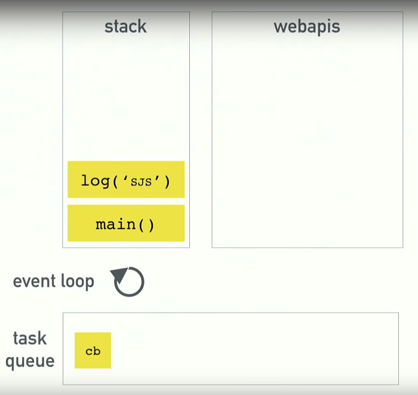

# JavaScript - Asynchroniczność

## Pętle zdarzeń & Callback Hell

JavaScript jest językiem jednowątkowym (single threaded) co oznacza, że mamy tylko jeden call stack, który może na raz obsłużyć tylko jedną instrukcję.

Elementy mechanizmów JS w przeglądarce

- Stos (stack)
- Web APIs
- Callback (task) queue
- Render queue



### Event loop

**Event loop** - zadaniem pętli zdarzeń jest przyglądanie się stosowi (stack) oraz kolejce zadań (task queue). Jeśli stos jest pusty bierze pierwszą rzecz z kolejki zadań i przenosi ją na stos.

```javascript
console.log("START");

setTimeout(function() {
  console.log("MID");
}, 5000);

console.log("END");

// Zwróci trzy console.log w kolejności: START, END, MIDDLE
```

### Browser redering

Przeglądarka próbuje renderować widok (repaint screen) co 16.6 milisekund (60 FPS), ale jest ograniczone przez operacje w JavaScript. Przeglądarka nie może renderować jeśli coś znajduje się w stosie.

Render:

- Ma wyższy priorytet niż callback(i)
- Jeśli wykonujemy kod synchronicznie renderowanie zostaje wstrzymane (brak możliwości zaznaczania tekstu, klikania w przyciski itp.)

### Callback Hell

Wynikająca z tego asynchroniczność prowadzi w konsekwencji do zjawiska nazywanego **callback hell**, która polega na tym, że jeśli potrzebujemy wykonać operacje w określonej kolejności to musimy zagnieżdżać callbacki

```html
<div class="go">Click Me</div>
```

```javascript
function go(e) {
    const el = e.currentTarget;
    // 1. Change the text to GO when clicked.
    el.textContent = 'GO';
    setTimeout(function () {
    // 2. Make it a circle after 2 seconds
    el.classList.add('circle');
    setTimeout(function () {
        // 3. Make it red after 0.5s
        el.classList.add('red');
        setTimeout(function () {
        // 4. make it square after 0.25s
        el.classList.remove('circle');
        setTimeout(function () {
            // 5. make it purple
            el.classList.remove('red');
            el.classList.add('purple');
            setTimeout(function () {
            // 6. fade out after 0.5s
            el.classList.add('invisible');
            setTimeout(function () {
                console.log('You have reacted the 7th layer of callback hell');
                el.classList.remove('invisible', 'purple');
            }, 500);
            }, 500);
        }, 500);
        }, 500)
    }, 500)
    }, 500)
```

http://latentflip.com/loupe/ - narzędzie do obrazowania asynchroniczności

## Promise

`Promise` - obiekt reprezentujący zakończenie lub porażkę asynchronicznej operacji i jej wartość. Obiekt `Promise` zawiera funkcję, która przyjmuje dwa parametry:

- `resolve()` - określa działanie w przypadku gdy promise zostanie spełniony
- `reject()` - określa działanie w przypadku gdy promise nie zostanie spełniony

```javascript
const promise1 = new Promise(function(resolve, reject) {
  setTimeout(function() {
    resolve("foo");
  }, 300);
});

promise1.then(function(value) {
  console.log(value);
  // expected output: "foo"
});

console.log(promise1);
// expected output: [object Promise]
```

```javascript
function makePizza(toppings = []) {
  return new Promise(function(resolve, reject) {
    // Reject if people try with pineapple
    if (toppings.includes("pineapple")) {
      reject("Seriously? Get out 🍍");
    }

    const amountOfTimeToBake = 500 + toppings.length * 200;
    // Wait 1 second for the pizza to cook:

    setTimeout(function() {
      // When you are ready, you can resolve this promise
      resolve(`Here is your pizza 🍕 with the toppings ${toppings.join(" ")}`);
    }, amountOfTimeToBake);

    // If something went wrong, we can reject this promise;
  });
}
```

```javascript
const wait = (ms = 0) => new Promise(resolve => setTimeout(resolve, ms));

wait(200).then(() => {
  console.log("Done!");
});

// Callback Hell refactored to Promise Land
function animate(e) {
  const el = e.currentTarget;
  // 1. Change the text to GO when clicked.
  el.textContent = "GO";
  // 2. Make it a circle after 2 seconds
  wait(200)
    .then(() => {
      el.classList.add("circle");
      return wait(500);
    })
    .then(() => {
      // 3. Make it red after 0.5s
      el.classList.add("red");
      return wait(250);
    })
    .then(() => {
      el.classList.remove("circle");
      return wait(500);
    })
    .then(() => {
      el.classList.remove("red");
      el.classList.add("purple");
      return wait(500);
    })
    .then(() => {
      el.classList.add("fadeOut");
    });
}
```

### `then()`

`then()` - uruchamia się gdy promise zostanie rozwiązany pozytywnie (`resolve`). Pozwala łączyć promise'y w łańcuchy i uruchamiać je sekwencyjnie (sequentially)

```javascript
makePizza(["pepperoni"])
  .then(function(pizza) {
    console.log(pizza);
    return makePizza(["ham", "cheese"]);
  })
  .then(function(pizza) {
    console.log(pizza);
    return makePizza(["hot peppers", "onion", "feta"]);
  })
  .then(function(pizza) {
    console.log(pizza);
    return makePizza(["pineapple"]);
  })
  .then(function(pizza) {
    console.log(pizza);
    return makePizza(["one", "two", "three", "four"]);
  })
  .then(pizza => {
    console.log("All done! here is your last pizza");
    console.log(pizza);
  });
```

### `catch()`

`catch()` - uruchamia się gdy promise zostanie rozwiązany negatywnie (`reject`). Pozwala wyłapać błąd i wykonać odpowiedni kod. Dla łańcucha promise'ów wystarczy jedna instrukcja `catch()`.

### `Promise.all()`

`Promise.all([promises])` - metoda statyczna, która łączy wiele promise'ów w grupę i zostaje rozwiązana (resolved) gdy wszystkie jej elementy zostaną wykonane. Jako argument przyjmuje tablicę z listą promise'ów.

```javascript
// Uruchamianie jednoczesne
const pizzaPromise1 = makePizza(["hot peppers", "onion", "feta"]);
const pizzaPromise2 = makePizza(["one", "two", "three", "four", "one", "two"]);
const pizzaPromise3 = makePizza(["ham", "cheese"]);

// Grupa promise'ów
const dinnerPromise = Promise.all([
  pizzaPromise1,
  pizzaPromise2,
  pizzaPromise3
]);
```

### `Promise.race()`

`Promise.race([promises])` - metoda statyczna, która łączy wiele promise'ów w grupę i zostaje rozwiązana (resolved) gdy pierwsza obietnica zostanie wykonana. Jako argument przyjmuje tablicę z listą promise'ów.

```javascript
const firstPizzaPromise = Promise.race([
  pizzaPromise1,
  pizzaPromise2,
  pizzaPromise3
]);

firstPizzaPromise.then(pizza => {
  console.log("You must be hungry, here is the first one ready");
  console.log(pizza);
});
```

### `Promise.allSettled()`

`Promise.allSettled([promises])` - metoda statyczna, zostaje rozwiązana gdy wszystkie promise'y otrzymają odpowiedni status, niezależnie od tego czy zostaną rozwiązane (resolved) czy odrzucone (rejected).

```javascript
const dinnerPromise = Promise.allSettled([p1, p2]);
```

## Async Await

**Async Await** - składnia pozwalająca znacząco uprościć asynchroniczne wykonywanie kodu.

- `await` - tymczasowo wstrzymuje wykonanie funkcji na bazie promise'u dopóki nie zostanie on rozwiązany (resolved). Z `await` można korzystać tylko wewnątrz funkcji `async`

```javascript
// Deklaracja funkcji async
async function fd() {}

// Funkcja strzałkowa z async
const arrowFn = async () => {};

// Call back z async
window.addEventListener("click", async function() {});

// Metoda z async
const person = {
  // Metoda
  sayHi: async function() {},
  // Skrótowa skłądnia
  async sayHello() {},
  // Function property
  sayHey: async () => {}
};
```

```javascript
// Przykłady funkcji z wykorzystaniem async await
// Przykład 1
async function go() {
  console.log("Starting");
  await wait(2000);
  console.log("running");
  await wait(200);
  console.log("ending");
}

// Przykład 2
async function makeDinner() {
  const pizzaPromise1 = makePizza(["pepperoni"]);
  const pizzaPromise2 = makePizza(["mushrooms"]);
  const [pep, mush] = await Promise.all([pizzaPromise1, pizzaPromise2]);
  console.log(pep, mush);
}

makeDinner();
```

```javascript
// Promise Land refactored to Async Await

async function animate2(e) {
  const el = e.currentTarget;
  // 1. Change the text to GO when clicked.
  el.textContent = "GO";
  // 2. Make it a circle after 2 seconds
  await wait(200);
  el.classList.add("circle");
  await wait(500);
  el.classList.add("red");
  await wait(250);
  el.classList.remove("circle");
  await wait(500);
  el.classList.remove("red");
  el.classList.add("purple");
  await wait(500);
  el.classList.add("fadeOut");
}
```

### `async try` & `catch`

```javascript
async function go() {
  try {...}
  catch (err) {...}
}
```

### Obsługa błędów Async podczas definiowania funkcji

- Łączenie składni `async` & `await` z obsługą błędów poprzez `catch()`
- Przydatne jeśli chcemy obsłużyć błędy na poziomie definiowania funkcji

```javascript
function handleError(err) {
  console.log("ERROR");
  console.log(err);
}

async function go() {
  const pizza = await makePizza(["pineapple"]).catch(handleError);
  return pizza;
}
```

### Obsługa błędów Async podczas wywołania funkcji

- Przydatne jeśli chcemy obsłużyć błędy podczas wywoływania funkcji

```javascript
async function go() {
  const pizza = await makePizza(["pineapple"]);
  return pizza;
}

// Catch error at run time
go().catch(handleError);
```

### Obsługa błędów Async za pomocą funkcji wyższego rzędu

```javascript
function makeSafe(fn, errorHandler) {
  return function() {
    fn().catch(errorHandler);
  };
}

const safeGo = makeSafe(go, handleError);

safeGo();
```

## AJAX

**AJAX (Asynchronous JavaScript and XML)** - technika, wzorzec, który umożliwia pobieranie i wysyłanie danych w sposób asynchroniczny, bez potrzeby przeładowania całej strony.

## JSON

**JSON** - format plików zbliżony strukturą do obiektów w JavaScript. Różni się od nich:

- Nazwy kluczy piszemy w cudzysłowach
- Uzywamy tylko podwójnych cudzysłowów
- Brak możliwości komentowania kodu

### Obiekt JSON

**Obiekt JSON** - pojedynczy obiekt, który udostępnia nam 2 metody: `stringify` i `parse`. Nie jest to klasa obiektów (więc nie używamy do tworzenia słowa kluczowego `new`).

`JSON.stringify(ob)` - Zamienia dany obiekt na tekstowy zapis w formacie JSON

`JSON.parse(obStr)` - Zamienia zakodowany wcześniej tekst na obiekt JavaScript

```Javascript
const ob = {
    name : "Piotr",
    surname : "Nowak"
}

const obStr = JSON.stringify(ob);
console.log(obStr); // "{"name":"Piotr","subname":"Nowak"}"

console.log( JSON.parse(obStr) ); // Nasz wcześniejszy obiekt
```

## CORS

**CORS - Cross-Origin Resource Sharing** - istniejące w przeglądarkach zabezpieczenie, które nakłada restrykcje na wykonywanie połączeń między różnymi domenami.

Zabezpieczenie takie powoduje, że domyślnie nie jesteśmy w stanie wykonywać dynamicznych połączeń między plikami na dysku, jeżeli naszą stronę otwieramy bezpośrednio z dysku (np. 2x klikając na ikonę). Wynika to z tego, że taki plik otwierany jest na adresie `file://...`, a adres ten nie jest poprawną domeną. Rozwiązaniem jest serwowanie strony z serwera lokalnego.

## XMLHttpRequest

**XMLHttpRequest** - obiekt, służy do nawiązywania dynamicznych połączeń XHR

### Metoda open()

`xhr.open(typ, url, [async, login*, password*])` - metoda konfigurująca połączenie, przyjmuje 3 atrybuty:

- typ połączenia (`get, post, put, patch, delete`)
- adres do którego się łączymy
- parametr określający czy nasze połączenie ma być asynchroniczne czy synchroniczne (dodatkowo możemy podać login i hasło w przypadku Basic HTTP Authentication).

### Metoda send()

`xhr.send()` - metoda służąca do wysyłania połączenia na serwer. Jeśli wysyłamy dane podajemy je jako atrybut.

```javascript
const xhr = new XMLHttpRequest();

//typ połączenia, url, czy połączenie asynchroniczne
xhr.open("GET", "https://jsonplaceholder.typicode.com/posts", true);
xhr.send();

// GET
xhr.send(null);

// POST
xhr.send(formData);
```
