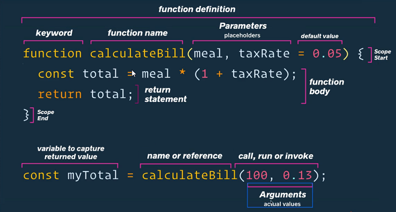

# JavaScript - Funkcje

## Funkcje

### Tworzenie funkcji

```javascript

// Deklaracja
function myFunc() {
    ...
}

// Wyrażenie funkcyjne (funkcja anonimowa przechowywana w zmiennej)
const myFunc = function() {
    ...
}

// Funkcja strzałkowa (wyrażenie funkcyjne)
const myFunction = () => {
    console.log(a, b);
}

// Immediately-invoked function expression (IIFE)
(function() {
    console.log('Jakiś tekst'); //wywoła się od razu
})();

// Funkcja zwrotna (callback)
element.addEventListener('click', function() {
    ...
});
```

```javascript
nazwaFunkcji(); // Wywołanie
```

### Schemat funkcji



### arguments & parameters

**parameters** - placeholdery argumentów funkcji

**arguments** - obiekt zawierający wszystkie argumenty funkcji

```javascript
// Parameters
function sum(a, b, c, d) { // Parameters a, b, c, d
  ...
}

// Arguments
function sum() {
  console.log(arguments);
}

sum(1, 2, 3, 4); // [1, 2, 3, 4]
sum("ala", "ma", "kota"); // ["ala", "ma", "kota"]
```

### Operator rest

**rest** - operator zawierający wszystkie argumenty funkcji w postaci tablicy

```javascript
function superSum(...args) {
  console.log(args);
  [1, 2, 3, 4];
}
superSum(1, 2, 3, 4);
```

```javascript
function superSum(...args) {
  let result = args.reduce(function(a, b) {
    return a + b;
  });

  console.log(result);
}

superSum(1, 2, 3, 4);
```

### Domyślne wartości dla parametrów

W ES6 wprowadzono domyślne wartości dla parametrów

```javascript
function print(name = "Marcin", status = "najlepszy") {
  console.log(name + " jest " + status);
}

print(); // "Marcin jest najlepszy"
print("Karol"); // "Karol jest najlepszy"
print("Marcin", "głupi"); // "Marcin jest głupi"
```

Aby wymóc na funkcji odwołanie się do domyślnego parametru należy podać jako argument `undefined`.

### Instrukcja return

**return** - kończy działanie funkcji i zwraca wykonanie kodu po słowie kluczowym

```javascript
function sumTwo(a, b) {
  return a + b;
}
```

### Funkcja strzałkowa

Wprowadzony w ES6 sposób zapisy, który zmienia słowo kluczowe function na strzałkę (fat arrow)

```javascript
// Jeżeli funkcja nie ma parametrów, dajemy nawiasy i strzałkę (fat arrow)
const myF = function() { ... }
const myF = () => { ... }

// Jeżeli funkcja wymaga tylko jednego parametru pomijamy nawiasy
const myF = function(a) { ... }
const myF = a => { ... }

// Jeżeli funkcja wymaga większej ilości parametrów, dajemy nawiasy
const myF = function(a, b) { ... }
const myF = (a, b) => { ... }

// Jeżeli funkcja zwraca tylko jedną instrukcję możemy pominąć klamry
const myF = function(a) { console.log(a); }
const myF = a => console.log(a);

// Jeżeli funkcja tylko coś zwraca, możemy pominąć instrukcję return
const myF = function(a) { return a * a; }
const myF = a => a * a;
```
